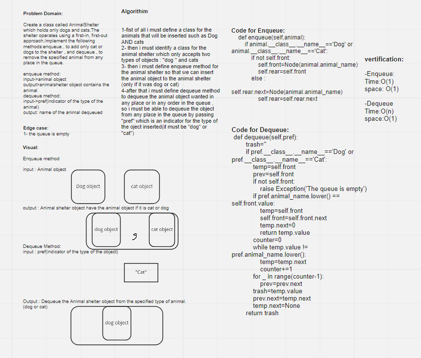

# Challenge Summary
<!-- Description of the challenge -->

Create a class called AnimalShelter which holds only dogs and cats.The shelter operates using a first-in, first-out approach.Implement the following methods:enqueue , to add only cat or dogs to the shelter , and dequeue , to remove the specified animal from any place in the queue.

## Whiteboard Process
<!-- Embedded whiteboard image -->

## Approach & Efficiency
<!-- What approach did you take? Why? What is the Big O space/time for this approach? -->
* O complexity for (AnimalShelter.queue) method: O(1)

* O complexity for (AnimalShelter.dequeue) method: O(n)

## Solution
<!-- Show how to run your code, and examples of it in action -->

>Animalshelter.enqueue"""This method adds a Cat/Dog object to the AnimalShelter queue.
  Arguments:
  animal: Cat or Dog object
  """

>AnimalShelter.dequeue"""  This method removes a Cat/Dog object to the AnimalShelter queue.
  Arguments:
  pref : Cat or Dog object
  Return: Dequeued object / None
"""

