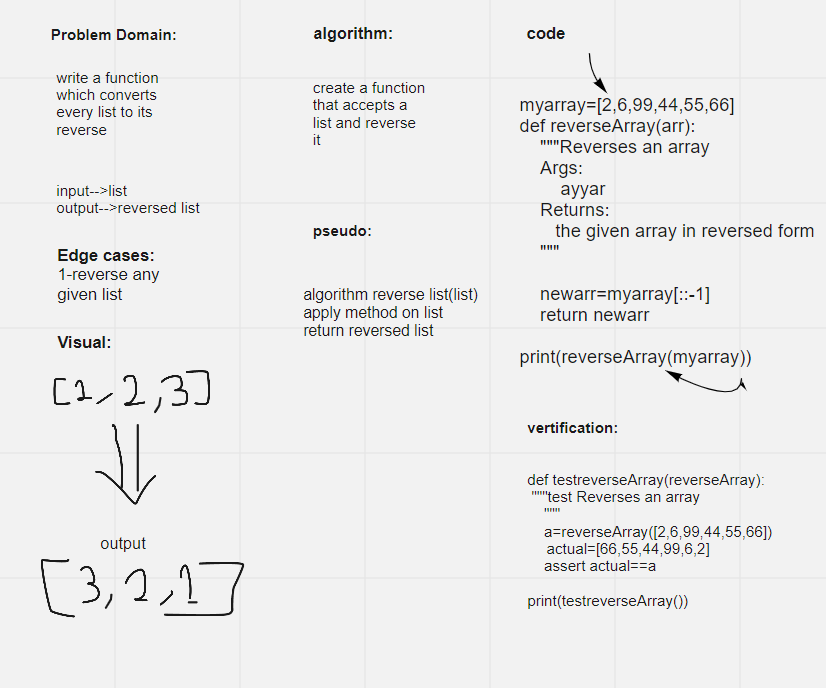

# Reverse an Array
<!-- Description of the challenge -->
the challenge is that given an array of number the output must be a reversed array without using the built in functions of python

## Whiteboard Process
<!-- Embedded whiteboard image -->

## Approach & Efficiency
<!-- What approach did you take? Discuss Why. What is the Big O space/time for this approach? -->
time:O(n)
space:O(1)
