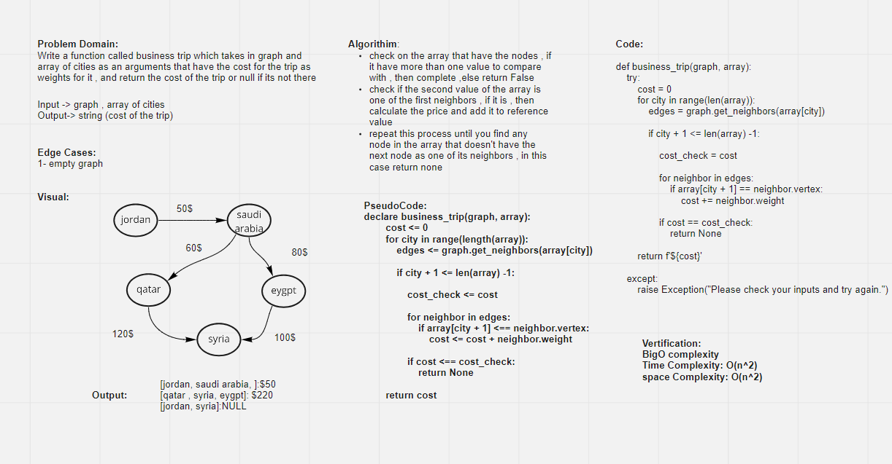

# Graph business trip
<!-- Short summary or background information -->
A graph is a non-linear data structure that can be looked at as a collection of vertices (or nodes) potentially connected by line segments named edges.

## Challenge
<!-- Description of the challenge -->
Write a function called business trip which takes in graph of cities as Arguments that have the cost for the trip as wiegth for it , and return the cost of the trip or null if its not there

## White Board

## Approach & Efficiency
<!-- What approach did you take? Why? What is the Big O space/time for this approach? -->
Time comlexity for  busniess_trip: O(n^2)
space comlexity for busniess_trip : O(n^2)

## API
<!-- Description of each method publicly available in each of your hashtable -->

>busniess_trip"""
    business_trip calculates if trips between cities are possible and calculates their total cost.
    Arguments:
        graph: graph of available flights and their costs
        array: an array containing destinations
    Return: Str, the cost or None
    """

