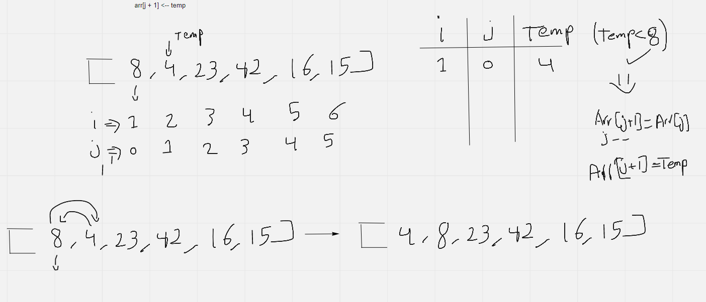
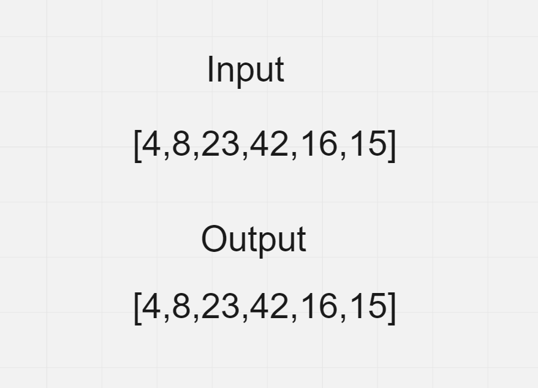
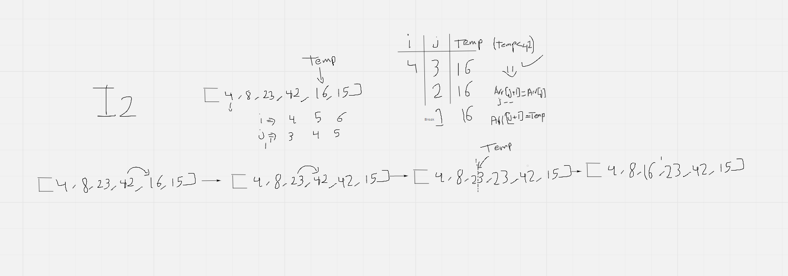
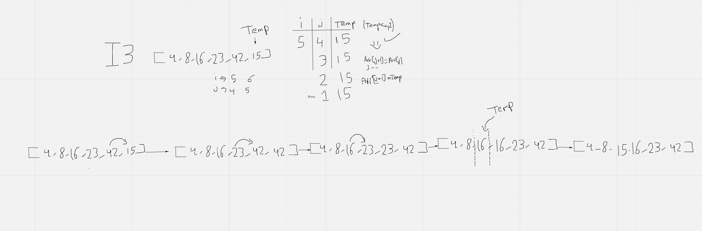

### Pseudocode
>  `InsertionSort(int[] arr)`
   `FOR i = 1 to arr.length`
      `int j <-- i - 1`
      `int temp <-- arr[i]`
     ` WHILE j >= 0 AND temp < arr[j]`
        `arr[j + 1] <-- arr[j]`
        `j <-- j - 1`
      `arr[j + 1] <-- temp`

### Trace:

Sample Array: [8,4,23,42,16,15]

**pass 1:**

* in the `first iteartion` of the for loop above , the `temp` will be 4 and the compare value (`arr[j]`) will be 8 , so the condition of the while loop will be `TRUE`

* after entering the while loop we will change the value at the `temp` position into the compare value which is 8

* then we will check the while loop again and its condition will be False after decrease of `j` value

* then we will change the value at the position of the compare value into the `temp` value

**pass 2 - 4:**

from `Iteration 2` to `iteration 4` the condition of the while loop of our code will be `FALSE` , so literally nothing will happen because the `temp` value is not smaller that the compare value (the `temp` value is not smaller than the `preceding value`)

**pass 4:**

* here the `temp` will be 16 , which is less than 42 (`compare value`) , and its less than the `preceding value` of the compare value (23)
* so here the first thing we will `save` the value of `temp` into a variable so we can compare it with preceding values

* we will go with the first compare value which is `42` , temp is less than it , so temp value will be changed to be the higher value (`the preceding value`)

* then we will go backward another step , and we will compare the `preceding of the temp` (the last compare value) with `the preceding of the last compare value` , while temp is less than the compare value we will change temp value to be the same as the biggest value , to have the greatest value always at the right of the array

* if the temp value still less than the new values we will continue going backward until this condition is FALSE.

* when the condition is false the last value that we compared with will be smaller than the `temp` value

* at this point we have to change the value after the last value that we compared with , to the `temp` (we saved it in the beginning)

**pass 5:**

* here the `temp` will be 15 , which is less than 42 (`compare value`) , and its less than the `preceding value` of the compare value (23) and also less than (16)
* so here the first thing we will `save` the value of `temp` into a variable so we can compare it with preceding values

* after that we will have the exact same steps of **pass 4** above ,go ahead and check it
### Efficency
Time: O(n^2)
Space: O(1)
