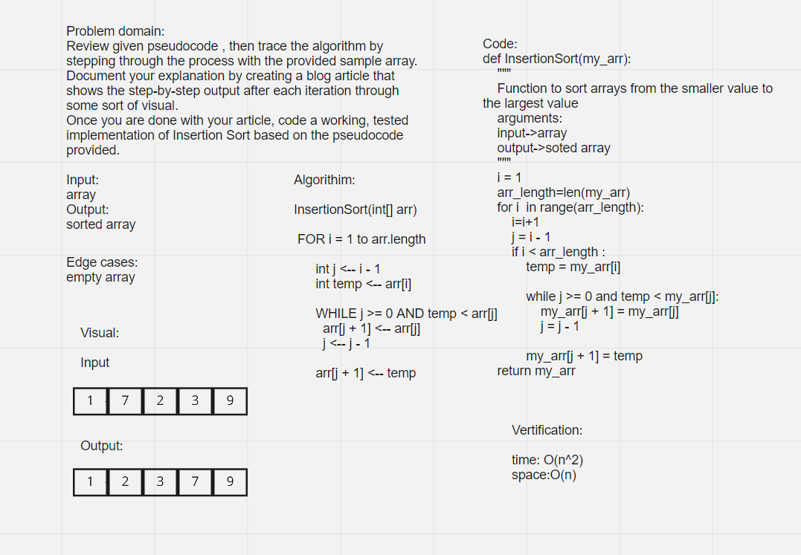

# Challenge Summary
<!-- Description of the challenge -->
Review given pseudocode , then trace the algorithm by stepping through the process with the provided sample array. Document your explanation by creating a blog article that shows the step-by-step output after each iteration through some sort of visual.
Once you are done with your article, code a working, tested implementation of Insertion Sort based on the pseudocode provided.

## White Board

## Approach & Efficiency
<!-- What approach did you take? Why? What is the Big O space/time for this approach? -->
Time: O(n^2)
Space: O(1)

## Solution
<!-- Show how to run your code, and examples of it in action -->
>"""
    Function to sort arrays from the smaller value to the largest value
    arguments:
    input->array
    output->soted array
    """
