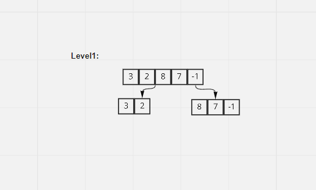
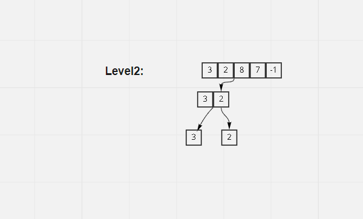
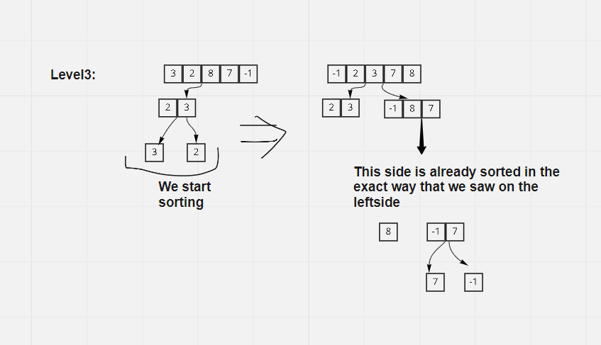

### Pseudo Code
```
ALGORITHM Mergesort(arr)
    DECLARE n <-- arr.length

    if n > 1
      DECLARE mid <-- n/2
      DECLARE left <-- arr[0...mid]
      DECLARE right <-- arr[mid...n]
      // sort the left side
      Mergesort(left)
      // sort the right side
      Mergesort(right)
      // merge the sorted left and right sides together
      Merge(left, right, arr)

ALGORITHM Merge(left, right, arr)
    DECLARE i <-- 0
    DECLARE j <-- 0
    DECLARE k <-- 0

    while i < left.length && j < right.length
        if left[i] <= right[j]
            arr[k] <-- left[i]
            i <-- i + 1
        else
            arr[k] <-- right[j]
            j <-- j + 1

        k <-- k + 1

    if i = left.length
       set remaining entries in arr to remaining values in right
    else
       set remaining entries in arr to remaining values in left
```

### Trace

* First stage:


- first of all ,merge sort will take the array that we want to sort , and it will tear it apart into two arrays , right , left array


* Second stage:


- Then the left array will enter the function again and it will be teared apart againt until it cant be partitioned any more , the we will start sorting the left and right and change the original array that the left and right arrays came from , we will change the values to be in ascending order , and we will repeat this process while we are going up in the previous levels.


* Third stage:



- the arrays of the left will be sorted , and the right also will be sorted , in the same logic that i describe before , then we will sort the first two teared array by sorting its parent (the original array that we want to sort) , then the result will be sorted array , and this is what we want.
