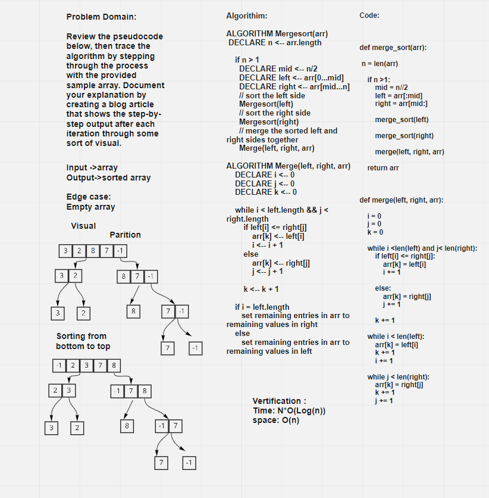

# Merge sort


## White Board


## Challenge

<!-- Description of the challenge -->
Review the pseudocode below, then trace the algorithm by stepping through the process with the provided sample array. Document your explanation by creating a blog article that shows the step-by-step output after each iteration through some sort of visual.

Once you are done with your article, code a working, tested implementation of Merge Sort based on the pseudocode provided.


```
ALGORITHM Mergesort(arr)
    DECLARE n <-- arr.length

    if n > 1
      DECLARE mid <-- n/2
      DECLARE left <-- arr[0...mid]
      DECLARE right <-- arr[mid...n]
      // sort the left side
      Mergesort(left)
      // sort the right side
      Mergesort(right)
      // merge the sorted left and right sides together
      Merge(left, right, arr)

ALGORITHM Merge(left, right, arr)
    DECLARE i <-- 0
    DECLARE j <-- 0
    DECLARE k <-- 0

    while i < left.length && j < right.length
        if left[i] <= right[j]
            arr[k] <-- left[i]
            i <-- i + 1
        else
            arr[k] <-- right[j]
            j <-- j + 1

        k <-- k + 1

    if i = left.length
       set remaining entries in arr to remaining values in right
    else
       set remaining entries in arr to remaining values in left
```


## Approach & Efficiency
<!-- What approach did you take? Why? What is the Big O space/time for this approach? -->

time complexity for merge_sort function is : N*O(log(N))
space complexity for merge_sort function is : O(n)
time complexity for mergefunction is :O(n)
space complexity for merge function is :O(n)


## API
<!-- Description of each method publicly available to your Linked List -->
>

>merge_sort()"""
    merge_sort function sorts list items in an ascending order, based on their values.
    Arguments:
        arr: list of integers
    Return:
        Modified list
    """


>merge"""
    merge function merges three lists into one in ascending order, based on their values.
    Arguments:
        left: list of integers
        right: list of integers
        arr: list of integers
    Return:
        None
    """
