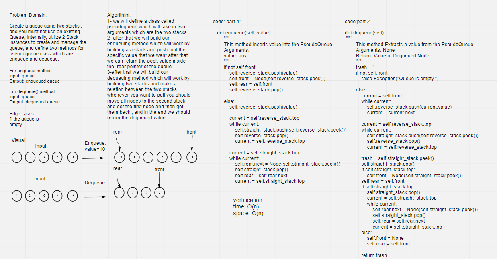

# Challenge Summary
<!-- Description of the challenge -->

Create a queue using two stacks , and you must not use an existing Queue, Internally, utilize 2 Stack instances to create and manage the queue, and define two methods for pseudoqueue class which are enqueue and dequeue.

## Whiteboard Process
<!-- Embedded whiteboard image -->

## Approach & Efficiency
<!-- What approach did you take? Why? What is the Big O space/time for this approach? -->
O complexity for (PseudoQueue.queue) method: O(n)

O complexity for (PseudoQueue.dequeue) method: O(n)

## Solution
<!-- Show how to run your code, and examples of it in action -->

>enqueue:"""
        This method Inserts value into the PseudoQueue
        Arguments:
        value: any
        """

>dequeue:"""
        This method Extracts a value from the PseudoQueue
        Arguments: None
        Return: Value of Dequeued Node
        """
