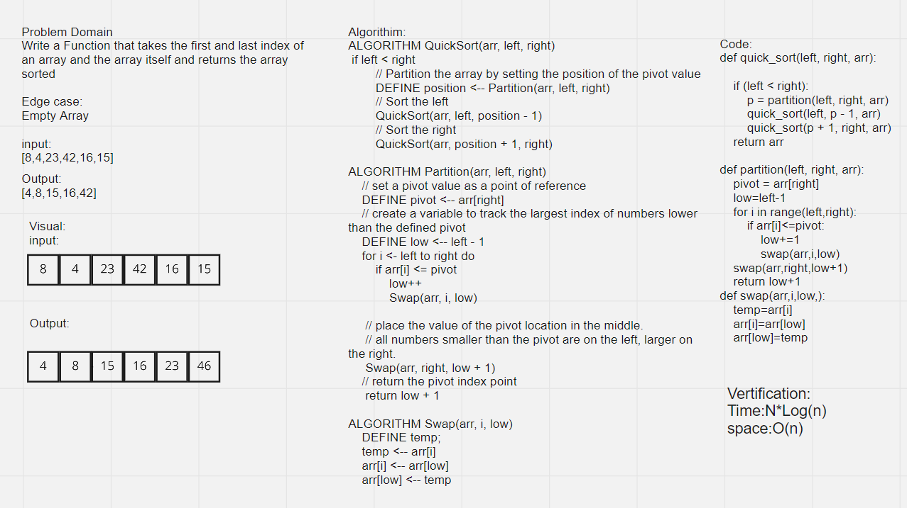

# Singly Linked List

## Challenge

<!-- Description of the challenge -->

Write a Function that takes the first and last index of an array and the array itself and returns the array sorted

## White Board

## Approach & Efficiency
<!-- What approach did you take? Why? What is the Big O space/time for this approach? -->
Time:N*Log(n)
space:O(n)

## API
<!-- Description of each method publicly available to your Linked List -->
>
> """
     Function that takes the first and last index of an array and the array itself and returns the array sorted
     argumnets:
     left=>int
     right=>int
     arr=>array
     Output=>sorted array
    """
