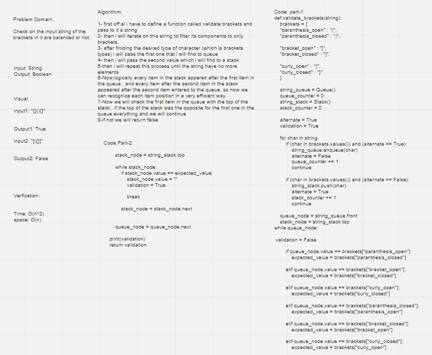

# Challenge Summary
<!-- Description of the challenge -->

Check on the input string of the brackets in it are balanced or not.

## Whiteboard Process
<!-- Embedded whiteboard image -->

## Approach & Efficiency
<!-- What approach did you take? Why? What is the Big O space/time for this approach? -->
* O complexity for (validate_brackets) method: O(n^2)

## Solution
<!-- Show how to run your code, and examples of it in action -->

>validate_brackets"""
    Representing whether or not the brackets in the string are balanced.
    -----------------
    Arguments:
    string: string
    Return: boolean
    """

