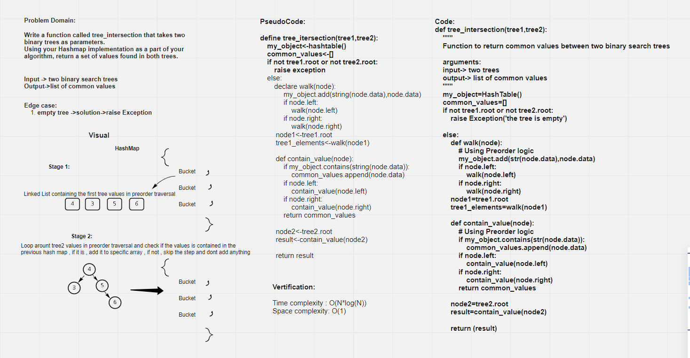

# Tree Intersection
<!-- Short summary or background information -->
Hashtables are a data structure that utilize key value pairs. This means every Node or Bucket has both a key, and a value.

## Challenge
<!-- Description of the challenge -->
Write a function called tree_intersection that takes two binary trees as parameters.
Using your Hashmap implementation as a part of your algorithm, return a set of values found in both trees.

## White Board

## Approach & Efficiency
<!-- What approach did you take? Why? What is the Big O space/time for this approach? -->
Time comlexity for tree_intersection : O(N*log(N))
space comlexity for tree_intersection : O(1)

## API
<!-- Description of each method publicly available in each of your hashtable -->

>tree_intersection"""
    Function to return common values between two binary search trees
    arguments:
    input-> two trees
    output-> list of common values
    """

