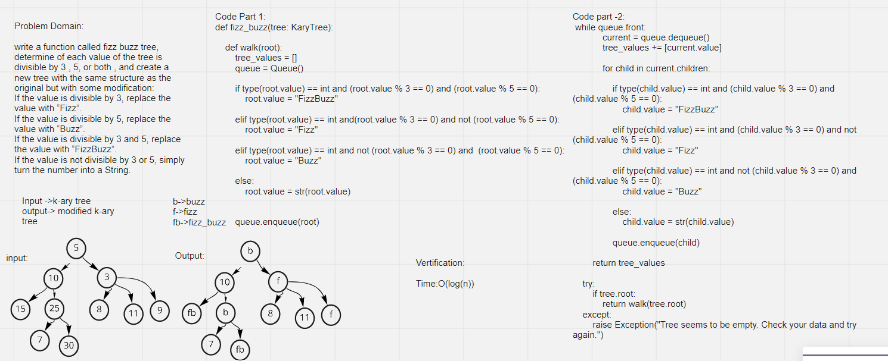

# Challenge Summary
<!-- Description of the challenge -->
write a function called fizz buzz tree, determine of each value of the tree is divisible by 3 , 5, or both , and create a new tree with the same structure as the original but with some modification:
If the value is divisible by 3, replace the value with “Fizz”.
If the value is divisible by 5, replace the value with “Buzz”.
If the value is divisible by 3 and 5, replace the value with “FizzBuzz”.
If the value is not divisible by 3 or 5, simply turn the number into a String.

## Whiteboard Process
<!-- Embedded whiteboard image -->

## Approach & Efficiency

<!-- What approach did you take? Why? What is the Big O space/time for this approach? -->
* O complexity for (KaryTree.traverse_kary_tree) method: O(log(n))

* O complexity for (fizz_buzz) function: O(log(n))

## Solution
<!-- Show how to run your code, and examples of it in action -->

>fizz_buzz"""
    Determines whether or not the value of each node is divisible by 3, 5 or both.
    Create a new tree with the same structure as the original, but the values modified as follows:
    If the value is divisible by 3, replace the value with “Fizz”
    If the value is divisible by 5, replace the value with “Buzz”
    If the value is divisible by 3 and 5, replace the value with “FizzBuzz”
    If the value is not divisible by 3 or 5, simply turn the number into a String.
    Arguments:
    tree: KaryTree
    Return: Modified KaryTree
    """
