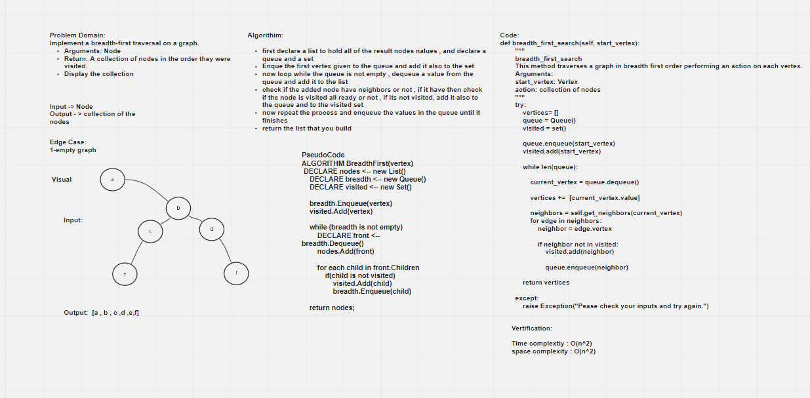
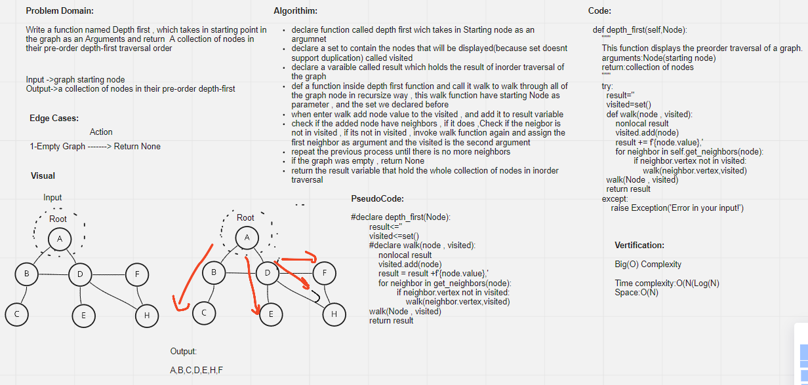

# Graphs
<!-- Short summary or background information -->
A graph is a non-linear data structure that can be looked at as a collection of vertices (or nodes) potentially connected by line segments named edges.

## White Board For Breadth first

## White Board for Depth First

## Challenge
<!-- Description of the challenge -->
Implement your own Graph. The graph should be represented as an adjacency list, and should include the following methods:
* add node
* add edge
* get nodes
* get neighbors
* size
* breadth first
* depth_first

## Approach & Efficiency
<!-- What approach did you take? Why? What is the Big O space/time for this approach? -->
Time comlexity for add_node : O(1)
space comlexity for add_node : O(1)
Time comlexity for size : O(1)
space comlexity for size : O(1)
Time comlexity for add_edge : O(1)
space comlexity for add_edge : O(1)
Time comlexity for get_nodes : O(1)
space comlexity for get_nodes : O(1)
Time comlexity for get_neighbors : O(1)
space comlexity for get_neighbors : O(1)
Time complextiy for graph breadth_first_search: O(n^2)
space complexity for graph breadth_first_search: O(n^2)
Time complextiy for graph depth_first: O(n*log(n))
space complexity for graph depth_first: O(n)

## API
<!-- Description of each method publicly available in each of your hashtable -->

>add_node"""
      Method for Adding a node to the graph
      Arguments: value
      Returns: The added node
    """

>size"""
    method to return the number of nodes in the graph
    """

>add_edge"""
    Adds an edge to the graph
    """

>get_nodes"""
    Method to get all nodes in Graph
    Arguments: None
    return: All nodes
    """

>get_neighbors    """
    Function to get the neighbors of a specific Vertex
    arguments: None
    Return : all neighbor nodes
     """

>breadth_first_search>"""
    breadth_first_search
    This method traverses a graph in breadth first order performing an action on each vertex.
    Arguments:
    start_vertex: Vertex
    Return: collection of nodes
    """

>depth_first"""
      This function displays the preorder traversal of a graph.
      arguments:Node(starting node)
      return:collection of nodes
      """

