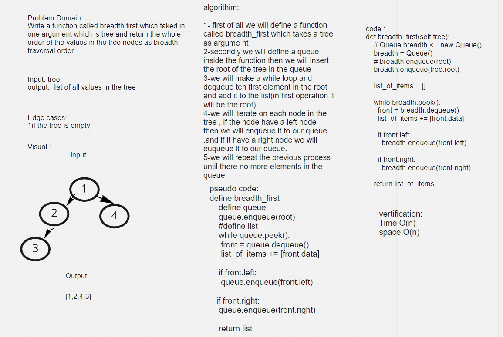

# Trees
<!-- Short summary or background information -->
A Tree is combination of nodes connected with each other ,  node is a component which may contain it’s own values, and references to other nodes

## Challenge
<!-- Description of the challenge -->
Create a Node class that has properties for the value stored in the node, the left child node, and the right child node. and Create a Binary Tree class and create methods for each of the depth first traversals such as `pre order` and `in order` `post order`  and define a class for Binary Search Tree

## Approach & Efficiency
<!-- What approach did you take? Why? What is the Big O space/time for this approach? -->

* time and complexity for (bfs) method: O(n)

* time complexity for (pre_order) methods: O(n)

* O time complexity for (in_order) method: O(n)

* O time complexity for (post_order): O(n)

## whiteboard for Code Challenge: Class 17

## API
<!-- Description of each method publicly available in each of your trees -->
>bfs"""
    A binary tree method which returns a list of items that it contains

    input: None

    output: tree items
    """

>pre_order"""
    A binary tree method which returns a list of items that it contains

    input: None

    output: tree items

    sub method : walk () to make the recursion staff
    """

>in_order """
    function to in order the list using Trees
    """

>post_order"""
    A binary tree method which returns a list of items in post order

    input: None

    output: tree items
    """

>breadth_first"""
    A binary tree method which returns a list of items that it contains
    Arguments: tree
    Return: list of all values in the tree, in the order they were encountered
    """
